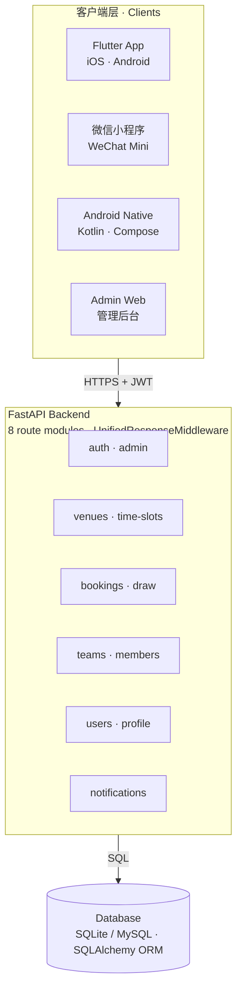
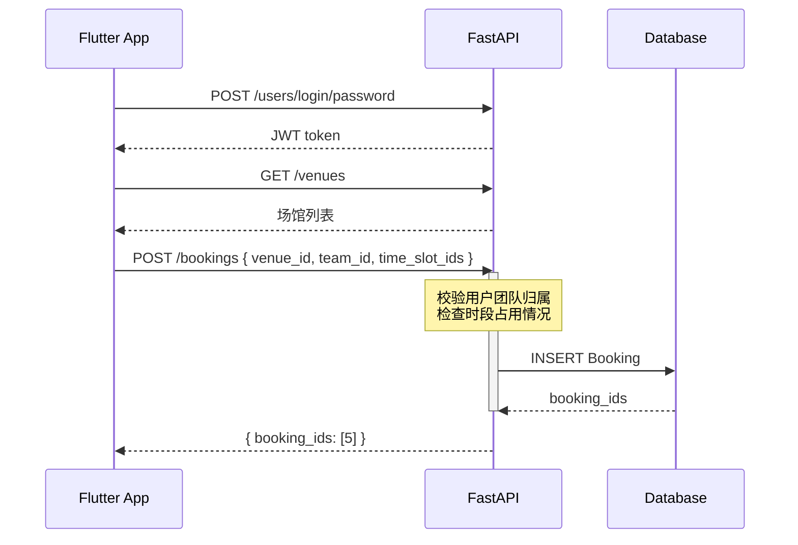
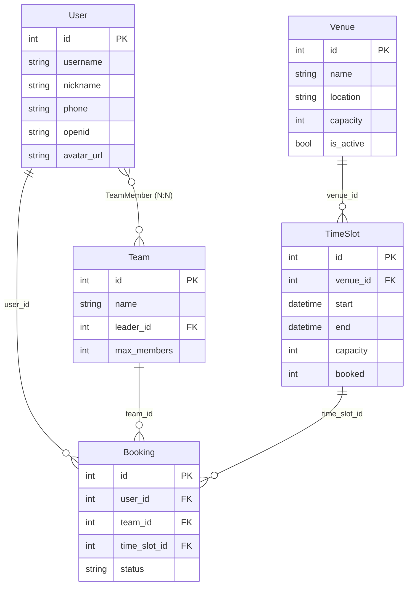

# 珠海艺术中心 · 系统架构

三层架构：多端客户端 → FastAPI 后端 → 数据库。

## 1. 系统架构

## 2. 用户预约创建 · 调用链路

从登录到预约创建的完整请求路径。

## 3. 核心数据模型 · 实体关系

Booking 为中心实体，关联用户、团队、场馆时段。

## 4. 后端路由模块

| 模块 | 路由前缀 | 职责 |
|------|----------|------|
| auth | `/api/auth` | 管理员登录、JWT 解析、角色权限校验 |
| admin | `/api/admin` | 管理员账号管理 |
| venues | `/api/venues` | 场馆列表、详情、可预约时段 |
| bookings | `/api/bookings` | 用户创建预约、管理员列表、自动抽签 |
| teams | `/api/teams` | 团队创建、详情、加入、退出 |
| users | `/api/users` | 用户注册、登录、资料、个人预约列表 |
| notifications | `/api/notifications` | 通知发布、已发布列表 |
| system | `/api/system` | 系统配置 |

## 5. Flutter 层级结构

```mermaid
flowchart LR
  subgraph UI["Screens"]
    Home["HomeScreen"]
    VenueDetail["VenueDetailScreen"]
    Bookings["BookingsScreen"]
    Team["TeamScreen"]
    Profile["ProfileScreen"]
    Login["LoginScreen"]
    Register["RegisterScreen"]
  end

  subgraph State["Providers"]
    AuthP["AuthProvider"]
    VenueP["VenueProvider"]
    BookingsP["BookingsProvider"]
    TeamP["TeamProvider"]
    ProfileP["ProfileProvider"]
  end

  subgraph Service["Service"]
    ApiS["ApiService<br/>Dio HTTP"]
  end

  UI --> State
  State --> ApiS
  ApiS -->|"HTTPS + JWT"| Backend["FastAPI Backend"]
```

